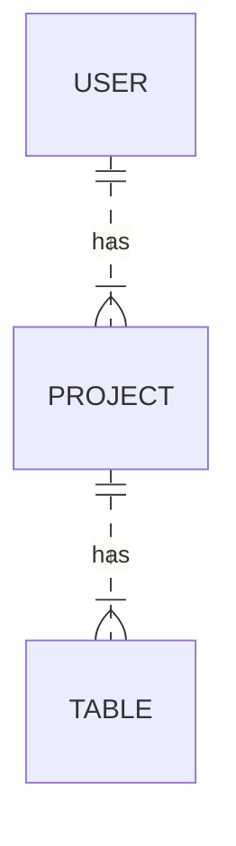

$ IsiTable
Sistema de geração de tabelas sob demanda via API SpringBoot
Por que este projeto?

Para que consigamos ter uma API que funcione parecido com um "AirTable", ou seja, o Usuário pode criar uma (ou mais) estruturas de tabelas e preencher dados nela via API REST (teremos um Backend que consiga manipular as operações básicas de GET/POST/PUT/DELETE em cada registro das tabelas)

Uma idéia de modelagem é a exibida a seguir:



Estrutura do JSON armazenado

```json
{	
  "table_id":1,
  "metadata":[
		{
          "field_id": 1,		
		  "field_name":"id_lead",
		  "field_type":"autonumber"
	    },
		{
          "field_id": 2,		
		  "field_name":"nome",
		  "field_type":"single_line"
	    },
		{
          "field_id": 3,		
		  "field_name":"email",
		  "field_type":"email"
	    },
		{
          "field_id": 4,		
		  "field_name":"telefone",
		  "field_type":"phone_number"
	    }
	],
	"data":[
		{
			"row": [
				{
					"field_name":"id_lead",
					"value": "1"	
				},
				{
					"field_name":"nome",
					"value": "Professor Isidro"
				},
				{
					"field_name":"email",
					"value": "isidro@isidro.com"
				},
				{
					"field_name":"telefone",
					"value": "11987654321"
				}
			]
		},
	    {
			"row" : [
				{
					"field_name":"id_lead",
					"value": "2"	
				},
				{
					"field_name":"nome",
					"value": "Joao do Teste"
				},
				{
					"field_name":"email",
					"value": "joao@teste.com"
				},
				{
					"field_name":"telefone",
					"value": "11987654322"
				}
			
			]				
		}
	]	
}
```
